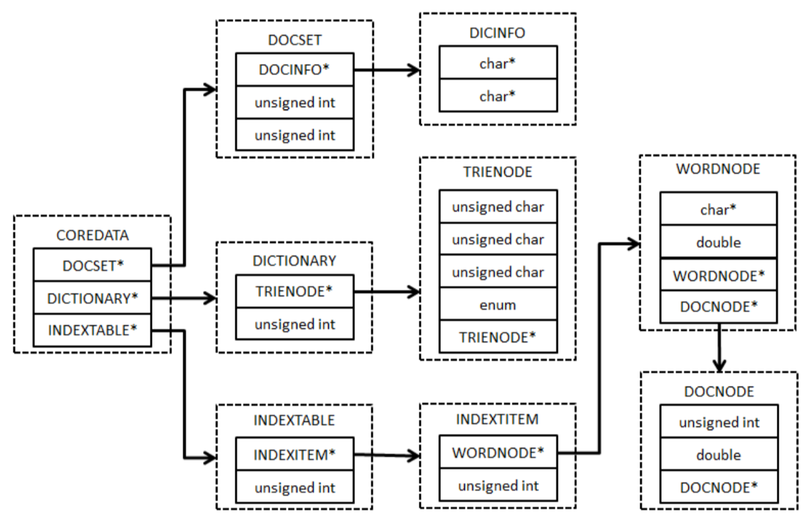
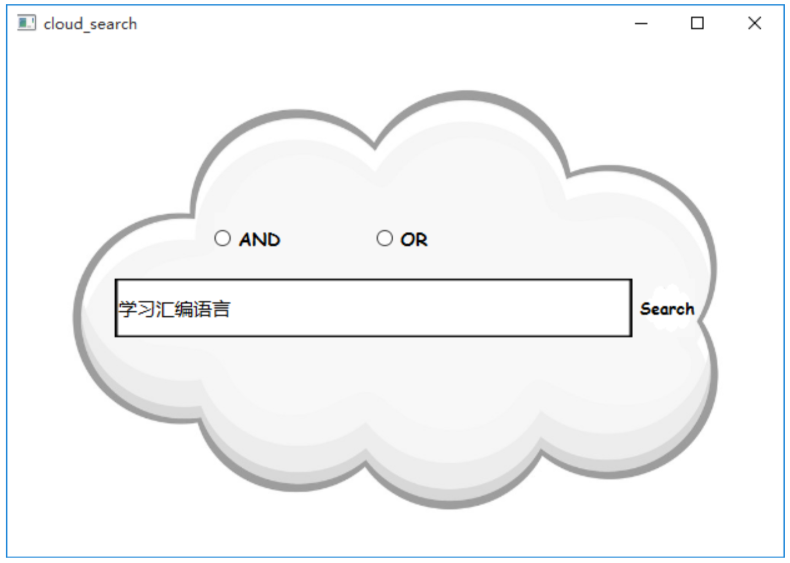

# Mini_Search
A Mini Search Engine, including parsing webpage, Chinese word segmentation, inverted index and boolean searching. The basic functions of this system are based on C, and the interface is based on C++ by Qt.

## Implement Stages
### Parsing webpage
Parse the webpages (totally 443) and extract the content.

### Chinese word segmentation
The word segmentation of search engine is divided into two parts: segmentation of webpage, used for the inverted index, and segmentation of the searching keywords. The mini_search used a dictionary-based approach, **Positive Maximum Matching**(from left to right).

To do: Try to solve the ambiguity and the recognition of OOV(out of vocabulary).
 
### Inverted index
* Create a Trie-tree Dictionary according to the vocabulary.
* Establish an inverted index table for keywords and the hash vaule of them.(**Djb2 hash**, **Chain address method**)
* Calculate the relevance of the word segmentation of webpages and keywords.

To do: Try to implement fault-tolerant retrieval, and compress the index table.

### Boolean searching
Enable AND and OR searching conditions, and sort the webpages according to **tf-dif**.

### Interface
Visual interface by QT.

To do: Try to highlight the keywords of webpages to improve the searching experience.

## Environment
VS2013 & QT5.5

## Data Struct & Interface

